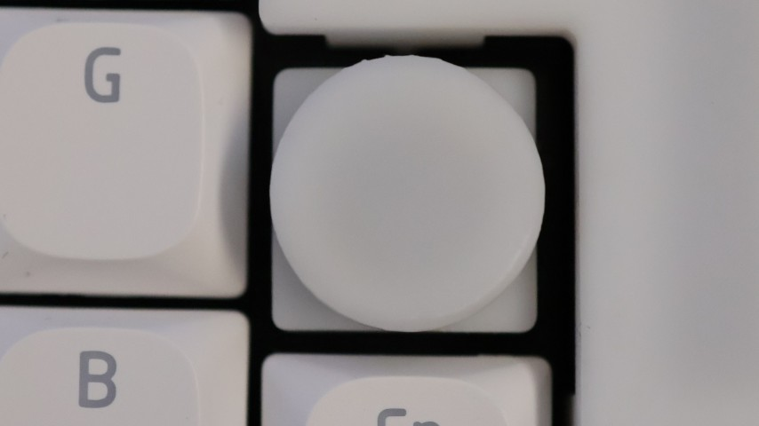
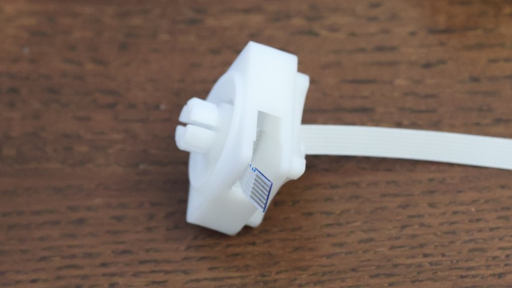
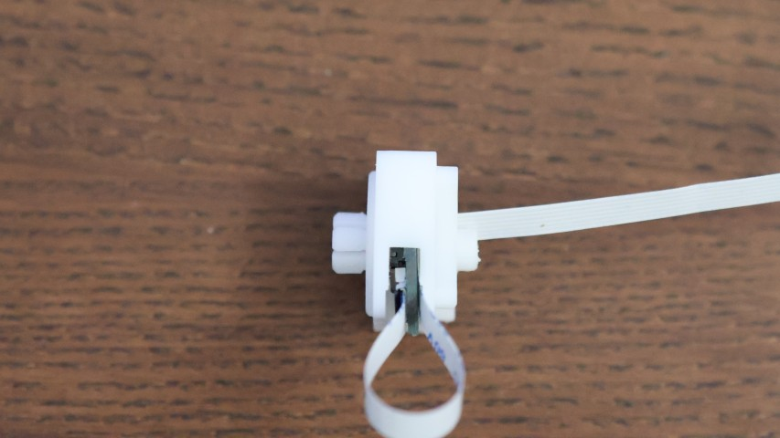
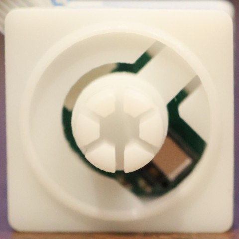
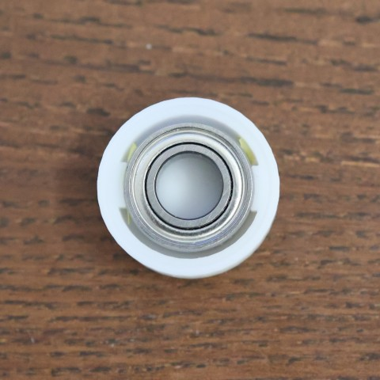
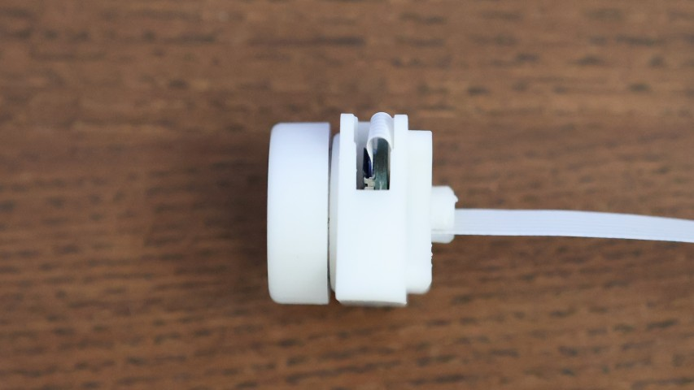

# 高分解能ダイヤルモジュール

16.5mm x 16.5mmサイズのダイヤルモジュールです。ロープロファイルスイッチと同様に固定できます。
1回転で約1500カウントの高分解能で、回転方向ごとにキーを割り当てたり、スムーススクロールしたり（Mac以外）、Windowsのラジアルコントローラ（Surface Dial）として動きます。ベアリング内蔵で滑らかに回転し、プッシュもできます。

## 同梱部品

- 基板
- ケース(3Dプリント品)
- ノブ(3Dプリント品)

## 別途ご用意が必要な部品

- 6P, 0.5mmピッチFPCケーブル(同一面)
  - コネクタとモジュールを配置したい場所の距離に応じて、必要な長さのケーブルをご用意ください

## 組み立て

### ケースにFPCケーブルを通す

FPCケーブルをケース下部から入れて、ピンセット等で側面から取り出します。
ケーブルを側面から引きまわしたい場合はこの手順は不要です。

### センサ基板にケーブルを取り付け、ケースに差し込む

ケースの凸部に引っかかって基板が入らない場合は、軽く上に引っ張って奥まで差し込んでください。

### ノブにベアリングを入れる

緩すぎる場合はマスキングテープ等で微調整してください

### ノブをハウジングに取り付ける

### キーボードに取り付ける

- ロープロファイルキースイッチ用の中央穴にFPCケーブルを通し、モジュールのケースを掴んでメイン基板のトッププレートの上からキーボードに取り付けます。
  - 押し込むときにノブを押し込まないようにしてください。力がかかりすぎて破損する危険があります。
  - トッププレートに嵌める部分がきつすぎる場合は軽くやすってください。
  - 中央穴がきつすぎる場合は、モジュールケースの中央ポストをペンチ等でつまんで軽く内側に癖をつけると取り付けやすくなります。

## ピン配置

0.5mmピッチ、6ピンのFPCで接続します。 同一電極面のFPCを使う場合、対向する側のコネクタでピン順が反転するので注意してください。

|番号|機能|説明|
|-|-|-|
|1|VCC(3.3V)|電源|
|2|MOTION|割り込み用|
|3|PUSH|押し込んだ時L|
|4|SCL|I2C, ホスト側でプルアップ必要|
|5|SDA|I2C, ホスト側でプルアップ必要|
|6|GND|電源|

## ドライバ

[ZMK用ドライバ](https://github.com/sekigon-gonnoc/zmk-driver-hires-dial)